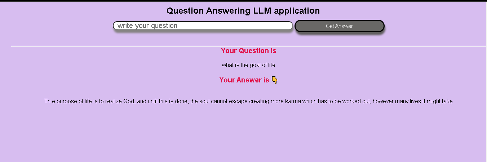

# LLM model based Question Answering project on Bhagwad Gita
 
 
To train the LLM model, i used i bhagwad gita pdf book,
 and in this application model knowledge base is a pdf file of
 bhagwad gita, if your question is comes from the knowledge base
 question, then my model will give the answer of your question.
 i developed a user friendly Web application to raise the questions,
 

## Demo of tha application

 ### step to execute this project
 1. clone this repository
 2. install all the dependencies.
 3. Run the base command to execute this project.

 ## commands
 to install the dependencies
 1. pip install -r requirements.txt
 2. python app.py   << to execute the project >>

 Thank you 😎

